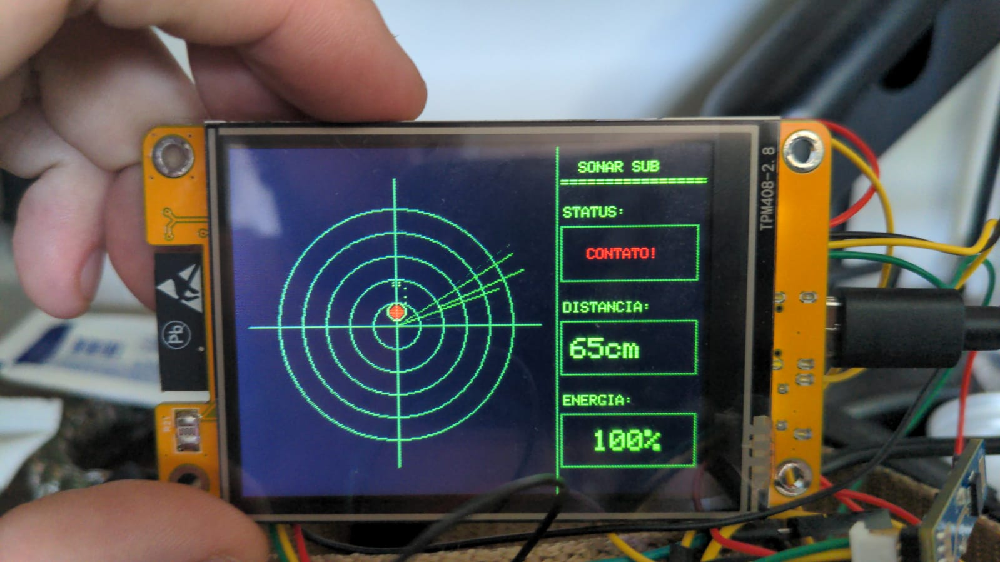
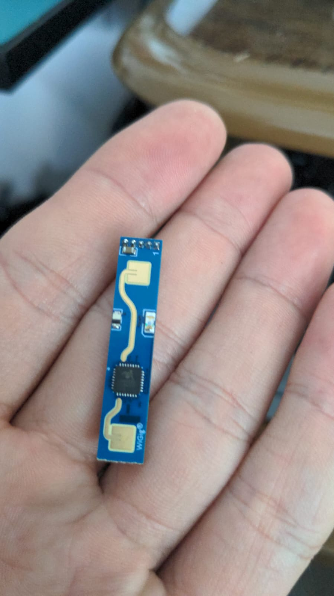

# 🛰️ Sistema de Sonar & Radar Submarino (ESP32 CYD + HLK-LD2410)

Sistema interativo de **Sonar Submarino / Telemetria Tática** desenvolvido para a placa de desenvolvimento **ESP32 Cheap Yellow Display (CYD / ESP32-2432S028)** integrada ao sensor de radar de ondas milimétricas (**mmWave 24 GHz**) **HLK-LD2410**.

O firmware implementa uma varredura polar contínua de 360°, processando sinal de alvos em movimento via barramento UART, plotagem vetorial de coordenadas relativas e exibição de telemetria em tempo real em um painel HUD (*Heads-Up Display*) lateral.

<p align="center">
  
</p>

<p align="center">
  
</p>

---

## 📸 Funcionalidades e Características Técnicas

* **Interface Gráfica de Sonar Submarino:** Animação vetorial polar de varredura contínua a 360° com renderização gráfica militar em paleta Fundo Preto / Verde Fósforo / Vermelho Alerta.
* **Rastreamento e Persistência de Alvo:** Algoritmo de amostragem que retém as coordenadas cartesianas $(X, Y)$ do alvo plotado durante todo o ciclo de varredura polar.
* **Telemetria HUD em Tempo Real:** Painel lateral dedicado com atualização de estado de contato (`CONTATO!` / `SEM CONTATO`), distância estimada do alvo em centímetros e nível de energia de reflexão RF (%).
* **Renderização Otimizada (Anti-Flicker):** Lógica de restauração seletiva de pixels e redesenho de grade que elimina o *flicker* (cintilação) sem necessidade de armazenamento de *double buffering* em RAM.

---

## 🧰 Especificação de Hardware

| Componente | Qtd. | Descrição Técnica |
| :--- | :---: | :--- |
| **ESP32 CYD** (*Cheap Yellow Display*) | 1 | Placa ESP32-2432S028 com display TFT ILI9341 de 2.8" (320x240 pixels) e controlador SPI |
| **Sensor HLK-LD2410** | 1 | Módulo radar FMCW mmWave de 24 GHz para detecção de presença e movimento (LD2410B/C) |
| **Cabos de Conexão** | 4 | Conector JST-SH ou Jumpers Fêmea-Fêmea para interface serial UART |
| **Fonte / Cabo de Alimentação** | 1 | Micro-USB ou USB-C (Tensão de operação 5 VDC / Corrente mímima 1A) |

---

## 🔌 Esquema de Ligação e Pinagem (Pinout)

O sensor **HLK-LD2410** conecta-se à porta de expansão **UART2** (conector `P4`) da placa ESP32 CYD. 

O diagrama abaixo deve ser visualizado em fonte monoespaçada:

```text
┌────────────────────────────────┐                ┌────────────────────────────────┐
│     ESP32 CYD (Conector P4)    │                │        Radar HLK-LD2410        │
│                                │                │                                │
│                         5V/VIN ├────────────────┤ VCC (Alimentação 5 VDC)        │
│                            GND ├────────────────┤ GND (Terra de Referência)      │
│                        GPIO 35 ├────────────────┤ TX (Saída Serial do Radar)     │
│                        GPIO 22 ├────────────────┤ RX (Entrada Serial do Radar)    │
└────────────────────────────────┘                └────────────────────────────────┘


⚠️ Notas Importantes de Integração:

Alimentação de 5V: O módulo HLK-LD2410 exige alimentação estável em 5 VDC para correto funcionamento do circuito de RF. Conecte estritamente ao pino VIN/5V.

Taxa de Transmissão (Baud Rate): A comunicação assíncrona da interface Serial2 opera na taxa de 256.000 baud.

Cruzamento de Sinais (RX/TX): O pino TX do sensor deve ser conectado ao RX do ESP32 (GPIO 35), e o pino RX do sensor ao TX do ESP32 (GPIO 22).

💻 Configuração do Ambiente e Bibliotecas
Bibliotecas Requeridas
Instale as seguintes bibliotecas através do Gerenciador de Bibliotecas do Arduino IDE:

TFT_eSPI por Bodmer

ld2410 por ntechde

⚙️ Configuração da TFT_eSPI para o Hardware CYD
Antes da compilação, configure o arquivo User_Setup.h (ou selecione o header específico para o ESP32 Cheap Yellow Display) no diretório da biblioteca TFT_eSPI com o mapeamento de pinos do display:

C++

#define ILI9341_DRIVER
#define TFT_MISO 12
#define TFT_MOSI 13
#define TFT_SCLK 14
#define TFT_CS   15
#define TFT_DC    2
#define TFT_RST  -1
#define TFT_BL   21
